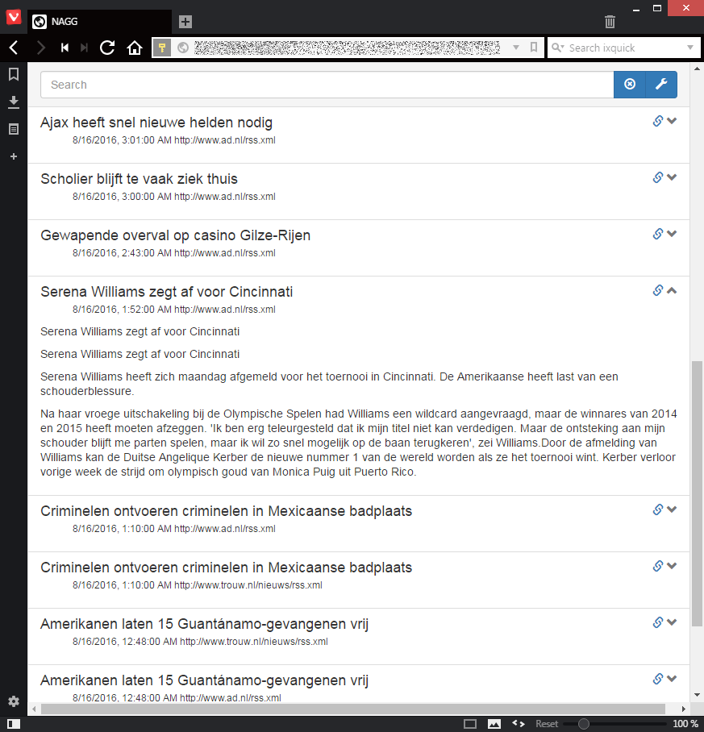

================
News Aggregator!
================

Dev Quick Start
===============

First see note about UID / GID and volumes in `Notes`_.

1. Install docker engine and docker compose
#. docker-compose build
#. docker-compose up
#. When postgresql errors, CTRL-C and re-run docker-compose up
#. In a new terminal do the following. Only need this once or after updating
   packages.json.  Because we mount the code from the host into the container
   this installs the node modules there.

  1. docker-compose exec nagg_app bash
  #. ./activate_nagg_env.sh
  #. cd /nagg_src/static_root && npm install

Browse to `the application <http://localhost:8000/>`_. No news items are
visible yet because the celery task that leeches new entries has not run
yet. You can initiate a leech run::

  # in a new terminal
  $ docker-compose exec nagg_app bash
  root@17f8c7449778:/#  ./activate_nagg_env.sh
  bash: cannot set terminal process group (1187): Inappropriate ioctl for device
  bash: no job control in this shell
  (nagg_ve) nagg@17f8c7449778:/$ nagg_manage nagg_run

Now observe lots of output on the terminal that is running the
`docker-compose up`.

Contents
========

==================== =========================================================
Path                 Description
==================== =========================================================
brains               ML stuff / common pyspark functions
django_nagg          Django main project dir
doc                  Sphinx (API) docs
docker               Dockerfile and scripts
local_data           persistent volumes for postgresql and redis containers. `(.gitignored)`
mainpage             Django app Web-UI
nagg                 Django app data acquire / storage
shell_ipynb          IPython notebooks with random experiments
static_root          Static files, served by django's runserver. contains 3rd party JS
==================== =========================================================

Notes
=====

There are hardcoded paths!

1. docker-compose volumes (``/nagg_download``)
#. findspark in `brains/spark_common.py`
#. IPython notebooks

Hardcoded UID / GID (1000) for the nagg user in Dockerfile for great convenience
when mounting code from host!  When your user on the docker host has different
UID / GID, please change accordingly in `Dockerfile`.

Javascript
==========

Currently using require JS, considering using webpack because ES 6 transpiling
and sane importing / exporting!

Screenshot
==========

